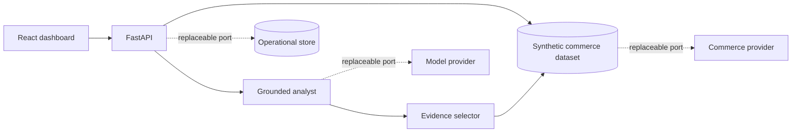

# AI Sales Analyst — commerce intelligence

[](https://github.com/juanlopolicaarpio/ai-sales-analyst-system/actions/workflows/ci.yml)

An ecommerce intelligence platform that turns orders, products, regions, and funnel data into anomaly alerts and evidence-linked recommendations across a dashboard and API.

> **Public release:** this system is based on software I built for autonomous ecommerce analysis. Confidential business data has been replaced with a fictional store and synthetic metrics. It contains no merchant credentials, customer records, or production connections.

## What it demonstrates

- A React/Vite analytics frontend with a responsive executive dashboard.
- A FastAPI service with typed contracts, request tracing, health endpoints, and OpenAPI documentation.
- A grounded analyst contract that returns an answer, confidence, evidence, and recommended actions.
- Deterministic anomaly detection and product/region diagnostics with no model fees.
- Explicit integration boundaries for commerce, storage, model, and notification providers.
- A reproducible public runtime with no credentials or network integrations.

## Demo architecture



The frontend also has a synthetic fallback, so a reviewer can explore the product even if the API is unavailable. With the API running, `/api/demo/ask` returns answers with explicit evidence references.

Read [the architecture deep dive](docs/ARCHITECTURE.md) and [AI design notes](docs/AI_DESIGN.md).

## Run the demo

### API

```bash
python -m venv .venv
# Windows: .venv\Scripts\activate
# macOS/Linux: source .venv/bin/activate
pip install -r requirements.txt
uvicorn app.main:app --reload
```

API docs: `http://localhost:8000/docs`

### Frontend

```bash
cd frontend
npm ci
npm run dev
```

Dashboard: `http://localhost:5173`

### Docker

```bash
docker compose up --build
```

## Example API

```bash
curl http://localhost:8000/api/demo/overview

curl -X POST http://localhost:8000/api/demo/ask \
  -H "Content-Type: application/json" \
  -d '{"question":"Which products need attention?"}'
```

The answer contract is deliberately inspectable:

```json
{
  "answer": "...",
  "confidence": "high",
  "evidence": [{ "id": "...", "label": "...", "period": "..." }],
  "actions": ["..."]
}
```

## Repository map

```text
app/api/             FastAPI routes and middleware
app/demo/            synthetic dataset and grounded analyst
frontend/src/        React dashboard and API client
tests/               deterministic analyst and API-contract tests
docs/                architecture and AI design decisions
```

## Integration boundary

This release publishes the product core, not historical merchant connectors. In a deployment, synthetic data is replaced behind a commerce-ingestion port, while model and notification providers sit behind separate server-side adapters. That keeps credentials and vendor-specific behavior out of analytics and UI code.

## Safety and limitations

- Juniper & Co., its products, regions, and metrics are fictional.
- The deterministic analyst is intentionally narrow and refuses to imply access to missing data.
- No public demo should be connected to a real merchant store or messaging account.

## Author

Built by [Juanlo Policarpio](https://github.com/juanlopolicaarpio).

Copyright © 2026 Juanlo Policarpio. All rights reserved. See [LICENSE](LICENSE).
