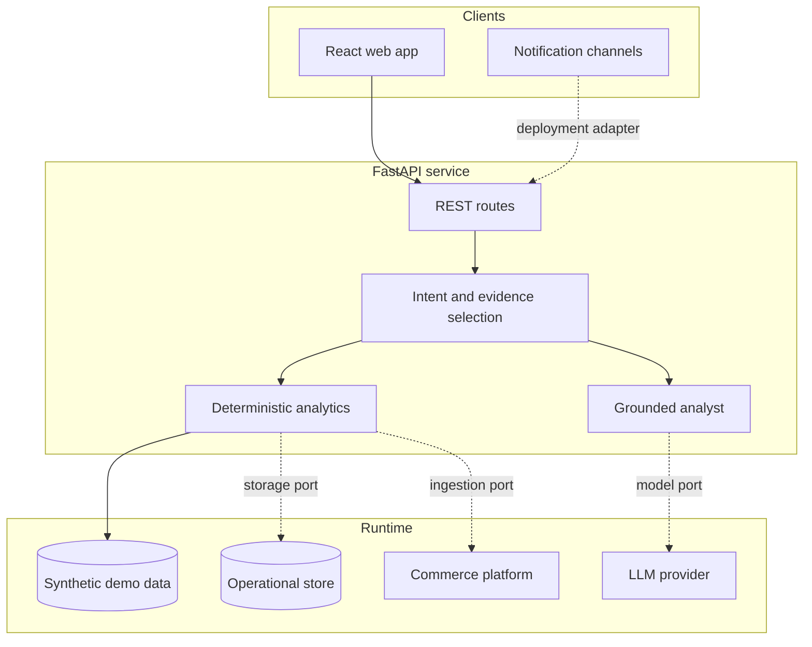
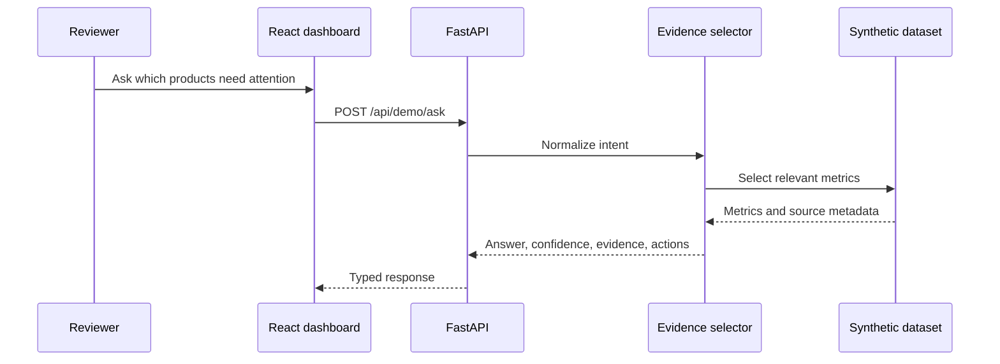

# Architecture

## Product boundary

AI Sales Analyst separates four concerns:

1. Commerce ingestion and persistence.
2. Deterministic analytics and anomaly detection.
3. Evidence packaging and natural-language analysis.
4. Delivery through web and notification interfaces.

The public runtime exercises concerns 2–4 with synthetic data. External commerce, model, and messaging systems are represented as boundaries, not bundled connectors.

## System view

## Public-demo request flow

## Engineering decisions

### Analytics before language

Numerical aggregation, trend detection, and anomaly scoring belong in deterministic services. The language layer explains selected evidence; it does not calculate business truth.

### Explicit evidence contract

An answer includes source identifiers and periods. That contract can be rendered in a dashboard, notification, or audit log and tested without snapshotting prose.

### Public code has a deliberate boundary

The public release contains no historical merchant connector or credential schema. A deployment replaces the synthetic repository behind an ingestion port and keeps vendor authentication at the edge.

### Progressive deployment

The static frontend can demonstrate the product alone. Adding FastAPI enables the analyst API. Persistence, model, commerce, and notification adapters can then be introduced independently.
